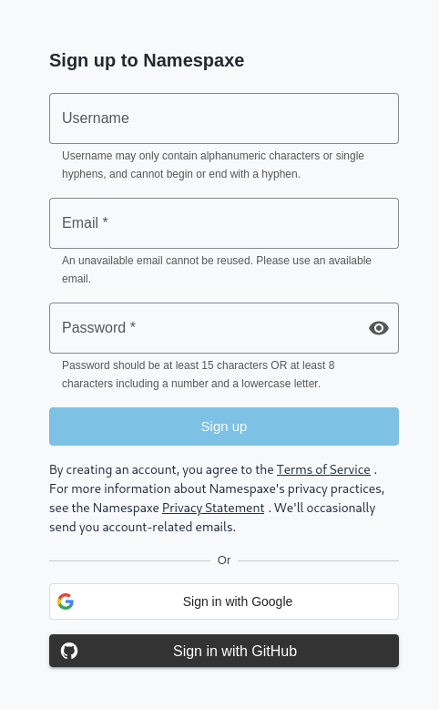
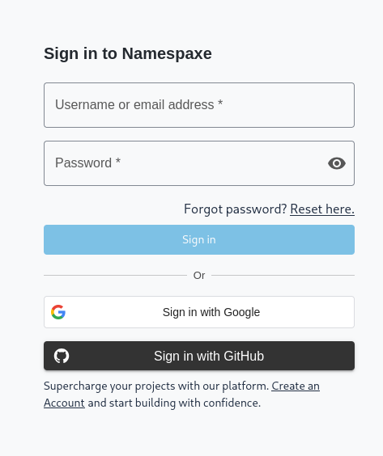
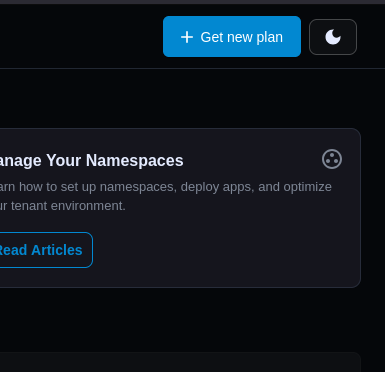
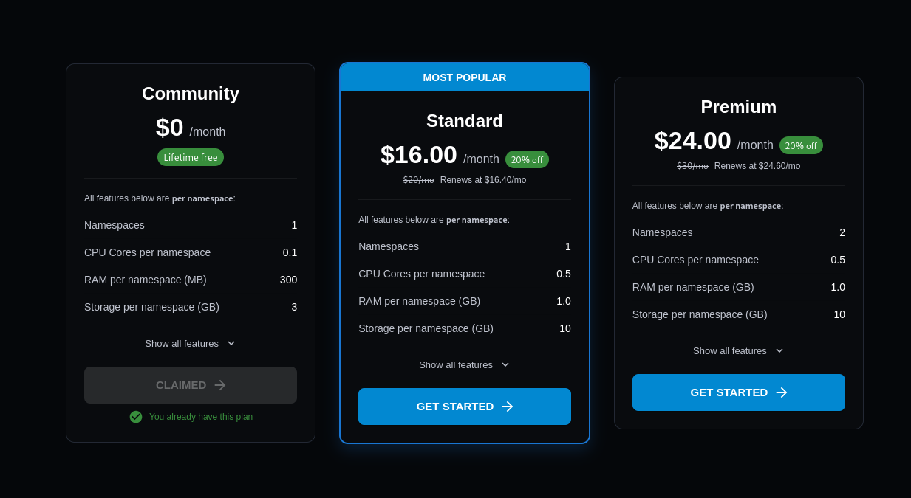
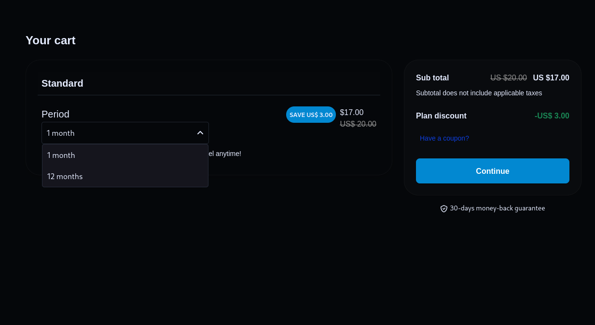
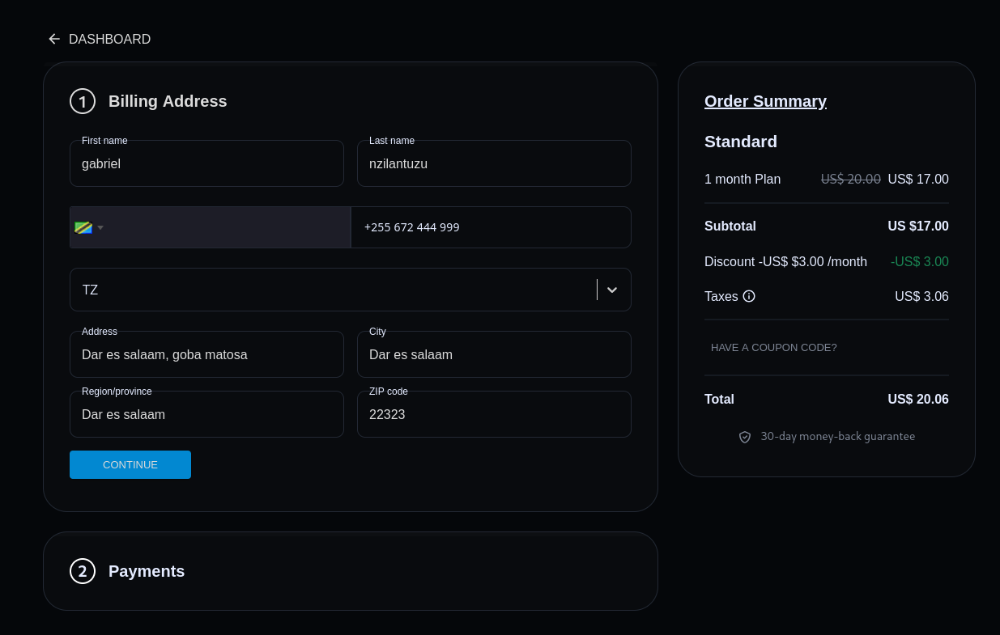
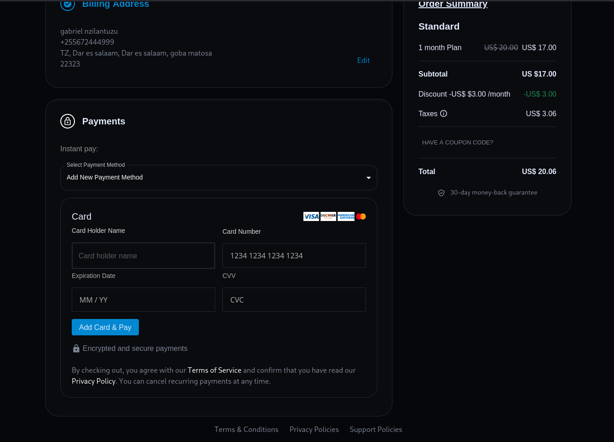
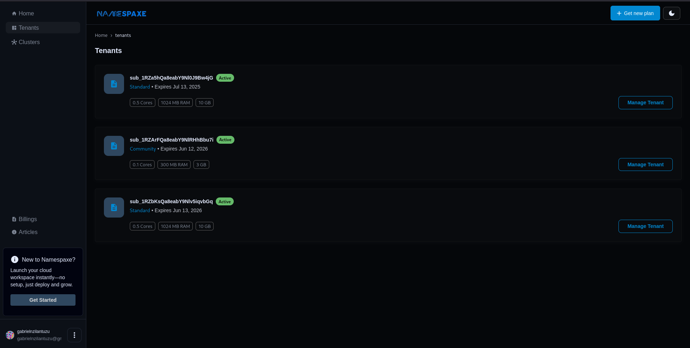
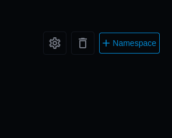
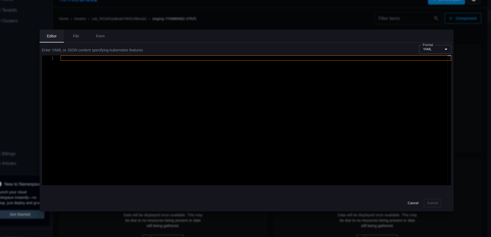

# Namespaxe Platform Testing Guide

**Platform URL:** [https://namespaxe.com](https://namespaxe.com)

## 🚀 Getting Started

Validate all critical functionality of the Namespaxe multi-tenant Kubernetes platform using this test suite.

## 🔐 1. Account Creations & Authentication Testing



### Test Case 1: Manually Account Creation

**Objective:** Manually create an account and validate the process

**Steps:**

1. On sign-up page, Fill information required by the sign up form
2. Click Sign up
3. If action goes correct, your redirected to Account verification page to verify your account
4. Enter OTP sent via you email to verify

**Verification:**

- [ ] Check username verification and error check
- [ ] Check email verification and error check
- [ ] Check strong password verification and error check

---

### Test Case 2: Email Login

**Objective:** Verify email/password authentication



**Steps:**

1. Navigate to [https://namespaxe.com/signin](https://namespaxe.com/signin)
2. Enter valid credentials:
   - Email: `your_test_user@company.com`
   - Password: `[valid_password]`
3. Click "Sign In"

**Verification:**

- [ ] Redirected to `https://namespaxe.com`
- [ ] Username appears in left-bottom of left navigation bar
- [ ] Refresh cookie contains `HttpOnly` and `Secure` flags
- [ ] Authentication is via stateless authenticaation.

---

### Test Case 3: GitHub OAuth

**Objective:** Validate third-party authentication

**Steps:**

1. On sign-in page, click "Signin with GitHub"
2. Complete GitHub authentication:
   - Enter GitHub credentials
   - Complete 2FA if enabled
3. Click "Authorize"

**Verification:**

- [ ] Redirected to Namespaxe dashboard
- [ ] GitHub account appears in Profile → Linked Accounts
- [ ] New session visible in Security → Active Sessions

---

### Test Case 4: Google OAuth

**Objective:** Validate third-party authentication

**Steps:**

1. On sign-in page, click "Signin with Google"
2. Complete Google authentication:
   - Enter Google credentials
   - Complete 2FA if enabled
3. Click "Authorize"

**Verification:**

- [ ] Redirected to Namespaxe dashboard
- [ ] GitHub account appears in Profile → Linked Accounts
- [ ] New session visible in Security → Active Sessions

---

### Test Case 5: Account Recovery

**Objective:** Test password reset workflow

**Steps:**

1. Visit [https://namespaxe.com/forgot-password](https://namespaxe.com/forgot-password)
2. Submit registered email address
3. Check inbox for "Password Reset Instructions" email
4. Click reset link (valid 24h)
5. Set new password:
   - New Password: `[secure_password]`
   - Confirm Password: `[secure_password]`

**Verification:**

- [ ] Confirmation toast message appears
- [ ] Can login with new credentials
- [ ] Old password rejects authentication

---

## 🔧 2. Edge Case Testing

**Negative Tests:**

- [ ] Attempt login with invalid email format
- [ ] Submit wrong password (verify lockout after 5 attempts)
- [ ] Click expired password reset link
- [ ] Revoke GitHub OAuth access via GitHub settings

## 🔒 Security Checks

- [ ] All authentication endpoints use HTTPS
- [ ] Session cookies have `SameSite=None` attribute
- [ ] Password field masks input

# Namespaxe Subscription Flow Test

**Test Environment:** [https://namespaxe.com](https://namespaxe.com)

## 🛒 Subscription Process Verification

### Prerequisites

- [ ] User is logged in ([Authentication Test Guide](#-1-authentication-testing))
- [ ] Account has no active subscription

---

## 🔄 Subscriptions testing

### 1. Initiate Subscription

**Action:**

- [ ] Click "Get New Plan" button in dashboard sidebar



**Verification:**

- [ ] Redirected to `/tenants/get-new-plan` page
- [ ] All available plans are displayed

---

### 2. Select Plan Package



**Action:**

- [ ] Choose "Community Plan" (Free tier)
  - _Note: This plan has lifetime free access_

**Alternative Test:**

- [ ] Select paid plan (Standard/Premium)

**Verification:**

- [ ] Plan details expand showing features
- [ ] "Get started" button is active

---

### 3. Select Billing Period

**For Paid Plans Only:**

- [ ] Select billing cycle:
  - [ ] Monthly
  - [ ] Annual



**For Community Plan:**

- [ ] Verify "Lifetime Free" badge appears
- [ ] No billing period selection shown

---

### 4. Enter Payment Details

**Test Cards to Use:**

| Card Type      | Number              | Expiry | CVC |
| -------------- | ------------------- | ------ | --- |
| Visa (Success) | 4242 4242 4242 4242 | 12/34  | 123 |
| Decline Test   | 4000 0000 0000 0002 | 12/34  | 123 |
| Auth Required  | 4000 0025 0000 3155 | 12/34  | 123 |



**Action:**

- [ ] Fill billing information:
  - Full Name: `Test User`
  - Address: `123 Test Street`
  - Country: `[Select]`
- [ ] Enter card details from test table
- [ ] Check "Save payment method" checkbox



**Verification:**

- [ ] Card number formatting works (auto-spaces)
- [ ] Expiry/CVC validation works

---

### 5. Complete Payment

**Action:**

- [ ] Click "Pay Now" button

**Expected Results:**  
✅ **Success Case:**

- [ ] Green success notification appears
- [ ] Redirected to dashboard
- [ ] Account shows upgraded plan in settings

❌ **Decline Case:**

- [ ] Red error message shows decline reason
- [ ] Card field gets highlighted

---

## 🧪 Additional Tests

- [ ] Test 3D Secure flow (use card 4000 0025 0000 3155)
- [ ] Other testing cards are available via: [https://docs.stripe.com/testing](https://docs.stripe.com/testing)
- [ ] Verify receipt email delivery
- [ ] Check subscription appears in Billing History
- [ ] Test cancelation flow

# Namespaxe Tenant & Namespace Management Test

**Prerequisite:** Successful subscription completion ([See Subscription Guide](#-subscription-process-verification))

## 🏢 Tenant Management Flow

### 1. Access Tenant Dashboard

**Steps:**

- [ ] Log in to [Namespaxe Dashboard](https://namespaxe.com)
- [ ] Locate and click "Tenants" button in left navigation bar
- [ ] Verify redirection to `/tenants` page



**Verification:**

- [ ] Default tenant appears (typically matches username)
- [ ] "Manage Tenant" button is visible for each tenant

---

### 2. Manage Selected Tenant

**Steps:**

- [ ] Click "Manage Tenant" on your primary tenant
- [ ] Verify URL changes to `/tenants/[tenant-id]`

**UI Checks:**

- [ ] Namespace list is visible (empty for new tenants)
- [ ] "+ Namespace" button appears in top action bar
- [ ] Cluster selector dropdown is present

---

## 🆕 Namespace Creation Test

### 3. Create New Namespace

**Steps:**

1. Click "+ Namespace" button
2. Complete popup form:
   - **Namespace Name:** (Test variations below)
   - **Cluster:** Select from available clusters
3. Click "Submit"



#### Test Matrix:

| Test Case             | Input Example      | Expected Outcome          |
| --------------------- | ------------------ | ------------------------- |
| Valid name            | `dev-environment`  | Success creation          |
| Starts with Uppercase | `S1-test`          | Error: Invalid format     |
| Contains underscore   | `test_env`         | Error: Invalid format     |
| Uppercase letters     | `PROD`             | Error: lowercase required |
| Special chars         | `test@ns`          | Error: Invalid chars      |
| Empty field           | (leave blank)      | Disabled submit button    |
| Max length (63 chars) | `a...` (63 chars)  | Success creation          |
| Over max length       | `a...` (64+ chars) | Error: Too long           |

**Verification:**

- [ ] Successful creation shows green toast notification
- [ ] New namespace appears in list within 10 seconds

## Namespace Deletion & RBAC Restoration

### 4. Delete Namespace

**Steps:**

1. Locate target namespace in the list
2. Click "🗑️" context menu
3. Confirm deletion in dialog:
   - [ ] Refer to "I understand this action is irreversible" (for immediate deletion)

### 4. RBAC restoration

**Steps:**

1. Locate target namespace in the list
2. Click "⚙️" context menu
3. Confirm restoration in dialog:
   - [ ] Refer to "I understand this action is irreversible" (for immediate restoration)

# Namespace Component Management Guide

**Prerequisite:** [Namespace Creation Completed](#-namespace-creation-test)

## 🏗️ Accessing Namespace Management

**Steps:**

1. [Login](https://namespaxe.com/signin) to dashboard
2. Navigate to:
   - [ ] **Option A:** Click "Manage" button next to target namespace
   - [ ] **Option B:** Click namespace name in the list
3. Verify URL pattern: `/tenants/[tenant-id]/[namespace]`

**UI Verification:**

- [ ] Right navigation bar shows 7 tabs:
- [ ] For small screens, current pointing left becomes active and when clicked it draws the right navigation bar:

---

## ✨ Component Creation Workflow

### 1. Launch Component Creator

**Steps:**

- [ ] Click "+ Component" button in header
- [ ] By default, editor is a creation method, Select creation other method if you like.
- [ ] Example components
- [ ] [Deployment.yaml](./k8-configs/deployment.yaml)
- [ ] [Service.yaml](./k8-configs/service.yaml)
- [ ] [Ingress.yaml](./k8-configs/ingress.yaml)

### 2. Creation Methods

#### Method A: Editor

1. Paste configuration (or use samples below)
2. [ ] Verify no errors in parser
3. Click "Submit"

#### Method B: File upload

```markdown
1. Click file uppload area to upload yaml or json file.
2. Click "Submit"
```

#### Method C: Form Wizard

```markdown
1. Select component type dropdown
2. Fill form fields (auto-validated)
3. Click "Submit"
```



# Namespace Component Management Guide

## 🛠️ Tab-Specific Operations

### 1. Workloads Tab

**Actions:**

- **Deployments:**
  - [ ] Scale replicas (up/down)
  - [ ] Rollback revisions
  - [ ] View pod templates
- **StatefulSets:**
  - [ ] Expand persistent volumes
  - [ ] Execute pod management policy
- **Pods:**
  - [ ] View logs (streaming)
  - [ ] Execute into container

---

### 2. **Network Tab**

**Actions:**

- **Services:**

  - [ ] Expose internal workloads via ClusterIP or NodePort
  - [ ] Update port mappings

- **Ingress:**
  - [ ] Add routing rules
  - [ ] Connect to a domain
  - [ ] Enable TLS (use namespaxe-issuer)

---

### 3. **Storage Tab**

**Actions:**

- **PersistentVolumeClaims (PVCs):**
  - [ ] Create PVCs (use namespaxe as storageClass)
  - [ ] Bind to workloads
  - [ ] Resize storage volumes

---

### 4. **Configuration Tab**

**Actions:**

- **Secrets:**

  - [ ] Create encrypted secrets
  - [ ] Mount into pods or use as environment variables

- **ConfigMaps:**
  - [ ] Store and update application configurations
  - [ ] Use as volume or environment variable sources

---

### 5. **RBAC Tab**

**Actions:**

- **Roles:**

  - [ ] Define granular access policies within the namespace

- **RoleBindings:**
  - [ ] Check if roles are binded to service account of user

---

### 6. **Events Tab**

**Actions:**

- [ ] Monitor real-time events related to the namespace
- [ ] View error logs, warnings, and audit history for all components

---
